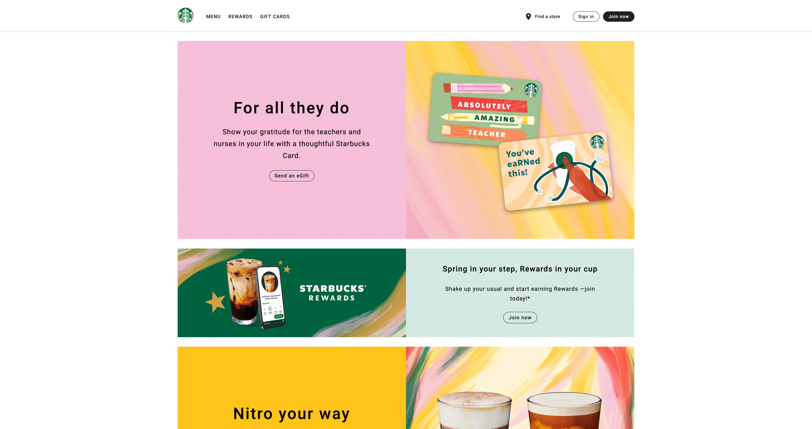

# StarBacks Clone

A reponsive starbucks landing page clone.

## Table of contents

- [Overview](#overview)
  - [Screenshot](#screenshot)
  - [Links](#links)
- [My process](#my-process)
  - [Built with](#built-with)
  - [What I learned](#what-i-learned)
  - [Continued development](#continued-development)
  - [Useful resources](#useful-resources)
- [Author](#author)

## Overview

### Screenshot



### Links

- Live Site URL: []()

## My process

### Built with

- Semantic HTML5 markup
- CSS custom properties
- Flexbox
- Mobile-first workflow

### What I learned

While working on this project, I learned a lot about web development and software engineering. Here are some of the key takeaways:

- Problem-solving: One of the most challenging aspects of this project was creating the hamburger animation. I had to research different strategies and lots of trial and error but ultimately succeeded.
- Personal growth: Overall, this project was a great learning experience for me, and I feel much more confident as a web developer and software engineer. I gained a deeper understanding of how web applications work and how to build them from scratch.

```html
<button class="hamburger-btn" aria-expanded="false">
  <div class="hamburger">
    <span class="top"></span>
    <span class="middle"></span>
    <span class="bottom"></span>
  </div>
</button>
```

```css
/* hamburger animation */

@keyframes hamburgerOne {
  0% {
    transform: translateY(0) rotate(0);
  }

  50% {
    transform: translateY(0.38rem) rotate(0);
  }

  100% {
    transform: translateY(0.38rem) rotate(135deg);
  }
}

@keyframes hamburgerTwo {
  0% {
    transform: translateY(0) rotate(0);
  }

  75% {
    transform: translateY(-0.35rem) rotate(0);
  }

  100% {
    transform: translateY(-0.35rem) rotate(45deg);
  }
}

.hamburger-btn[aria-expanded="true"] .hamburger .top {
  animation: hamburgerOne 0.5s forwards;
}

.hamburger-btn[aria-expanded="true"] .hamburger .middle {
  opacity: 0;
}

.hamburger-btn[aria-expanded="true"] .hamburger .bottom {
  animation: hamburgerTwo 0.5s forwards;
}
```

```js
hamburger.addEventListener("click", function () {
  mobileNavigation.classList.toggle("mobile-navigation-active");
  menuContainer.classList.remove("menu-container-active");
  navMask.classList.toggle("mobile-nav-mask");
  body.classList.toggle("scroll-disable");

  // hamburger animation
  hamburgerAnimation();
});
```

### Continued development

I will create the sign-up and join-now page in the near future.

### Useful resources

- [Basic, Intermediate & Pro animated hamburger icons - Kevin Powell(YouTube)](https://www.youtube.com/watch?v=R00QiudbD4Y&t=161s) - Learned a lot from this, even though I haven't used any of the animation from the video but this video really got me out of cognitive fixation. Also really recommend checking him out if you wanna up your CSS knowledge.

## Author

- linkedin - [Tanvi Chowdhury](https://www.linkedin.com/in/tanvi-chowdhury-244885271/)
